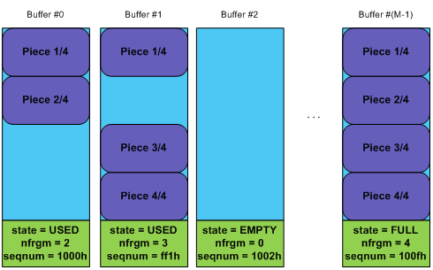
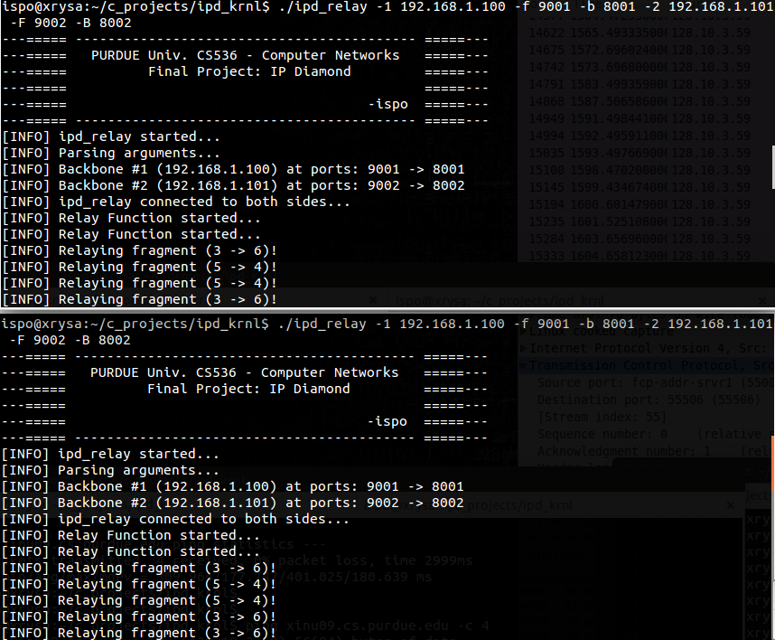
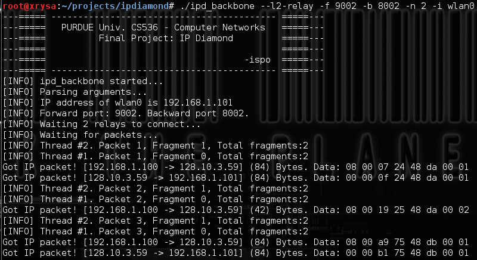
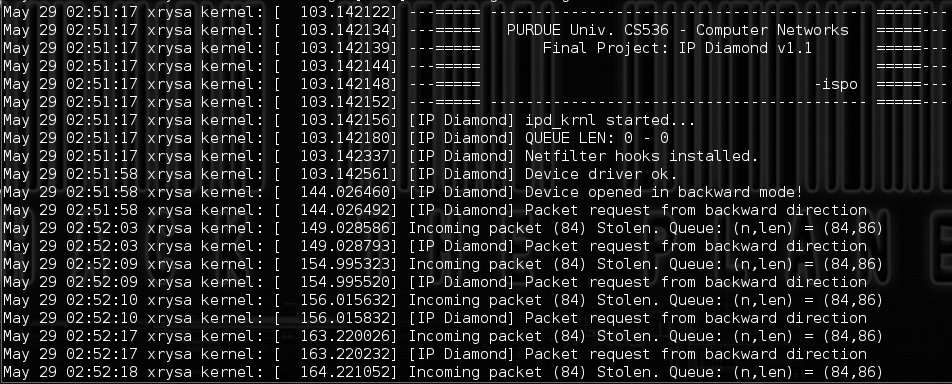
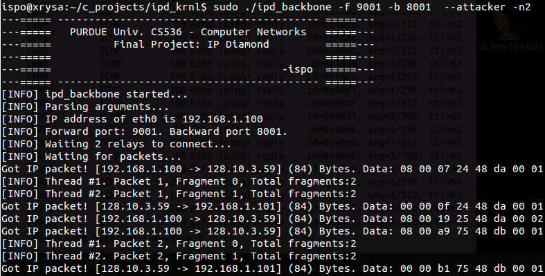
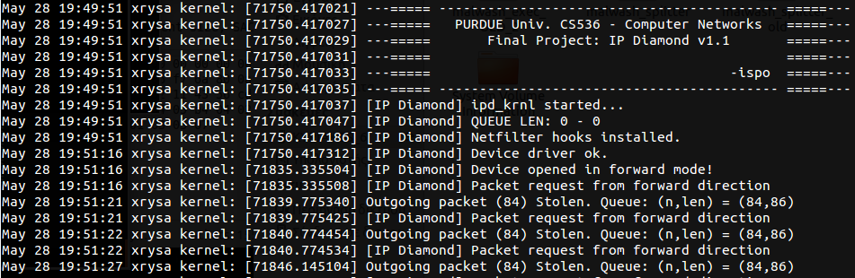
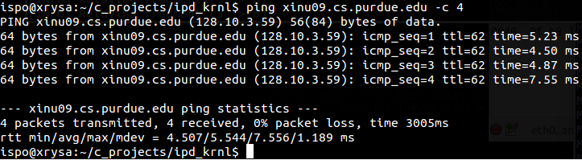

### Purdue CS536 - Data Communications and Computer Networking - Fall 2015
### Final Project
___

### Introduction

In this project we're dealing with a very common tradeoff that every attacker has. An attacker always
protects his real identity by using VPNs, Proxies, etc. Usually an attacker has a number of compromised
machines that uses as **relays** to forward traffic through them.

The more relays attacker uses, the harder is for investigators to detect his location. However, the 
more relays he uses, the worse the performance is.

The proposed solution here is to **parallelize the relays**; Attacker can use some relays in parallel,
to distribute the load. Thus each relay will have to forward less traffic.


___

### Design

Let's assume that we have an attacker who already has compromised (has under his control) some machines. 
3 of these machines are home computers (i.e. laptops or desktops) and one is an web server. 

If we assume that at a given time, all bots are up, then the attacker can build the following 
chain of relays as shown in Figure 1, in order to attack host www.victim.com:
 
")

If exchange "some stealthiness" with "some bandwidth", we can end up in the following layout:

")

We have a clear tradeoff here: performance VS stealthiness. At first glance it seems that our only 
options are to inflate/deflate the chain with relays, looking for a reasonable combination that fits 
in our attack. However we can do something very different (and hopefully better), by using a totally 
different layout. Let's take a look at Figure 3.

")


If we are able to split traffic in equal "pieces", redirect each pieces through a different 
route using our low bandwidth channels and reconstruct traffic in Relay #3, then we can have 
a better bandwidth than Case 1 and a better protection than Case 2. However we have 2 layers 
of protections, while we're using 4 relays. In some sense, we "trade" relays with bandwidth.
Because the layout of Figure 4 has a diamond shape and because we apply our filters on IP layer, 
we named this project **IP Diamond**.

But now, we have to deal with new problems: What traffic should we split? How to split the traffic? 
How to deal with NAT bots? How to deal with bots that suddenly go down? How to reliably reconstruct 
the traffic?

In this project we have chosen to split IP traffic. By doing this on IP layer, the attacker has 
many different attack options. Our filter will be a list of destination IP addresses. 
This means that we'll apply a filter  in all outgoing packets from attacker's machine. 
If we found a packet with destination IP address of www.victim.com, we "steal" it and 
instead of routing it as normal packet, we split it some pieces of equal size and we 
send each piece in a different "level 1" relay.

Relays 1,2 and 4 (all level 1 relays) will only have to redirect traffic from attacker's machine to 
our level 2 relay (Relay #3). At that point, Relay 3 has to merge all pieces of the IP packet,
change the source IP address (we don't want spoofed packet's as they'll be blocked by ISPs/ASes) 
to this of Relay #3 (we need to get the response back too) and we route the packet as a normal IP packet.
Οnce the packet successfully delivered to victim, the latter will probably respond. We have to follow 
exactly the same process in order to send the packet back to the victim. But now things are inverted: 
Relay #3 has to grab and split the packet and attacker has to merge packet pieces. But the job of
relays will remain the same.

##### Tunnelling

The first decision that we had to take was, how to carry the piece of IP packet. Some possible solutions 
are, IP, UDP and TCP. If use IP we'll be faster, because it's deeper in TCP/IP stack, but we have to 
worry about reliability. Furthermore, we'll need root privileges in relays, in order to grab raw IP 
packets. If we use UDP, we don't need root privileges, but still we have to worry about reliability. 
It seems that the only option is to use TCP.

By carrying IP over TCP, we don't have to worry about lost pieces. TCP will do all work for us.
However it's still possible that a relay will go down. In this case a piece will lost and never 
delivered. But we can easily detect such cases, because the TCP connection will terminate too. 
Two possible solutions are proposed:

*	Detect the missing piece (by detection the connection that closed), find a new relay, create a new path 
to the level 2 relay (or just simply use an existing path) and retransmit the missing piece.

*	Use redundancy. Instead of using 3 level 1 relays and splitting a packet in 3 pieces, use 
6 (9, or more) relays and send each piece twice (3, or more times) through 2 (3, or more) different 
paths. Relays here are cheap and usually a skilled attacker has hundreds of bots under his control, 
so this solution is absolutely reasonable. In this case we don't have to worry about retransmissions. 
We hope that at least one copy will arrive at the layer 2 relay.


We prefer the 2nd solution, because retransmissions introduce overhead and they'll have impact in efficiency 
(remember we're trying to improve efficiency here!). Furthermore, the second solution has one more advantage: 
If we send a piece over many low bandwidth paths, we'll have to wait until the fastest path brings the piece
 to us. This is another way to deal with problems that one slow path takes too long to deliver a piece of 
 the packet and thus, the whole IP packet will have to wait, until the last part arrives.
 
 
In any case we have to use sequence numbers and fragmentation offsets, in order to be able to reassemble 
packets, drop the duplicated pieces and distinguish between different packets. It's also better to send 
at most 1 piece of each packet in every path. If attacker serializes packets (i.e. sends 2 pieces from 
the same path), 


___

### Implementation

IP Diamond project consists of 3 main parts (modules):

**ipd_krnl**  A netfilter kernel module that steals IP packets that match with our rules and forwards 
them to ipd_usr.

**ipd_usr**	A user space process, that receives packets from kernel, splits them and sends each piece 
to a different level 1 relay using TCP.

**ipd_relay**	This code gets executed in level 1 relays. All it does, is to forward traffic.

**ipd_rsm**	A user space process that receives all pieces, reconstructs the original packet and forwards 
it to the victim.

Note that level 1 relays will only need ipd_relay, while attacker's machine and level 2 relay needs 
ipd_krnl, ipd_usr and ipd_rsm.

___

##### Using netfilter

Our kernel module installs a hook at OUTPUT chain, reads the packet and if it matches with our rules, 
"steal" it and send it to user mode. Note that "steal a packet" is different from "drop a packet". In 
the latter case an error message may be returned to the sender. When we steal a packet, we say
 netfilter to "forgot about that packet".
 
However, we shouldn't forget the reverse process, to steal the incoming packets too, i.e. when the 
response arrives at level 2 relay. This is as easy as installing a hook at point C (INPUT chain), right? 
But it's better to install the hook at PREROUTING chain, because it's possible that netfilter will 
discard the packet at PREROUTING chain before it reaches INPUT chain.

In PREROUTING chain, netfilter performs a lookup at routing table. If the packet is destined for this 
host is moved to INPUT chain. If not if goes to FORWARD chain. If IP forwarding is not enabled, 
then FORWARD chain will drop the packet. Packets arriving at relay are not really destined for that 
relay . In order to make sure that no packet will be dropped in PREROUTING chain, it's better not 
install the hook at INPUT chain.

Once we successfully steal the packet, we add it in a queue. Packets in the queue, will wait for the 
user process to read them. We need two queues: One for incoming and one for outgoing traffic.

___

##### Sending Packets to userspace

Once we successfully capture the packets we must send it to user space. There are many ways for moving 
data between user and kernel and some of them can be very efficient. What we do is to register a device 
driver and implement its basic interface (open, read, write, close). The user process will call open() 
to connect to our kernel module (driver). Then it can read a capture packet by invoking read(). If no 
packets are available, process will block until a packet arrives. write() is not doing anything it's 
there, only for completeness. When the process finishes with the packet relaying, it can invoke close(),
to inform kernel driver to stop capturing packets.

At this point we should mention, that it's possible for the kernel driver to directly split and send 
the packets to relays, instead of first sending them to user mode. This approach will have a slightly 
better performance, but it will be harder to implement it (programming in user space is a lot easier).


___

##### Splitting the packet
At this point the job of ipd_krnl has done. Now, ipd_usr has to process the captured packet. We present 
the pseudo-code below (we're using double redundancy):

```
wait until at least 2*N level 1 relays will connect to you
tell all level 1 relays the address of level 2 relay to connect to it

connect to kernel
for each packet P arrives from kernel
do
	spit P in N (almost) equally size fragments 
	make an ipd header for each fragment
	send fragment i with its header to relay i and to relay N+i
	// assume that at least one copy of each fragment will arrive
	// successfully. This is true because we assume that all relays 
	// are up and running

	if teardown request received
		terminate all connections
		disconnect from kernel
done

(when we refer to a fragment, we mean a packet's piece)
```


This was pretty simple isn't it? Note that this process is the same for both incoming packets 
(in level 2 relay) and outgoing packets (in attacker's machine).

The reliability that TCP provides, can help us a lot so we don't have to worry about retransmissions,
etc. However, because relays may be home computers, they can suddenly go down (although we have already 
assumed that they're always up). In this case the TCP connection will terminated and we'll know exactly 
which part of the packet was lost. This the one of the reason that we send at least 2 copies of the 
same fragment of the packet through different routes.
___

##### Relaying the packet

The process of relaying a packet -which the job of ipd_relay- is even simpler. Let's see the pseudo code:

```
connect to attacker's machine
read level 2 relay's IP address
connect to level 2 relay
spawn a new thread:

#MAIN THREAD:
for each packet fragment Pi that arrives from attacker's machine
do
	forward fragment to level 2 relay
done

#SECOND THREAD
for each packet fragment Pi arrives from relay 2
do
	forward fragment to attacker's machine
done
```

Level 1 relays should be able to handle bidirectional traffic. This is why we need 2 threads. 
While the one thread is waiting for incoming traffic, the other should be able to forward outgoing 
traffic. We could use non-blocking I/O with spinlocks here, but this is more efficient.

Although we can use the same TCP connection for forwarding both directions of traffic, it's better 
and less prune to errors if we use 2 separate connections; one for each direction of traffic.
The only disadvantage of keeping two alive TCP connections, is that is a little bit less stealthy. 
In this project we have chosen to use 2 TCP connections.

___

##### Reassembling the packet

The final part of our "puzzle" is ipd_rsm. The job of ipd_rsm is to get all pieces  of the packet 
and reassemble them. Packet pieces will probably arrive at different order (we need fragment numbers) 
and pieces from different packets may arrive at the same time (we need sequence numbers). 
That's why we need a header in every packet piece.

The first solution here is to have ipd_rsm to poll each connection (without blocking) in 
a round robin way. If a piece is available it will "put" a piece in the right place in buffer. 
When the buffer gets completed, the packet will be forwarded. Many buffers will be needed as 
it's possible a piece of a new packet to arrive while a piece of a previous packet is still missing. 

The second solution is better however. Instead of polling each connection, we spawn 2*N threads 
(one for each connection). Each thread blocks in a separate connection. When a piece of a 
packet arrives we choose the right buffer and we place it in the right slot (we'll come into 
this later). If this is the first piece we peek a new buffer. If the buffer becomes full, the 
thread that added the last fragment, forwards the packet and clears the buffer for the next use.
___

##### Buffer management

Buffer management maybe is the trickiest part of the project. We assume that we have M buffers, 
which means that we can have up to M incomplete IP packets. If we choose M to be fairly large 
and a power of 2, we have a very fast way to find the right buffer for each packet. All we have 
to do is to use the log2(M) LSBits of  sequence number as an buffer ID. This is the fastest and 
simplest possible way to select the right buffer.

The problem with that method, is that if the buffer is not empty, when a fragment from a new 
packet arrived, the packet will be dropped, although there may be empty buffers. By selecting a 
value for M which is big enough, the probability of this event becomes negligible. In case that 
we're trying to insert a fragment in buffer that contains fragments from a different packet, the 
sequence number in the buffer won't match with the sequence number of the fragment and thus, 
we'll drop that fragment. However the next fragment of the new packet may arrive successfully 
(because the previous packet completed and its buffer became free), waiting for a fragment that 
will never arrive (because we dropped it), resulting in wasting memory. For this reason, a timestamp 
is associated with each buffer. If a buffer remains incomplete for more than 3 seconds, ipd_rsm will 
automatically flush that buffer. 

Figure 13 shows an instance of our "buffer farm".  Each buffer holds some metadata that shown 
in green boxes below buffers. When a buffer goes to FULL state, the thread that added the last 
piece is responsible for patching the source IP address of the packet and forwards the packet.





___

### Running Backbone

##### Command Line Arguments
```
      --attacker      Backbone runs on attacker's machine
      --l2-relay      Backbone runs on level 2 relay machine
      -b PORT         Port for backward traffic
      -f PORT         Port for forward  traffic
      -i IFNAME       Interface name to use its IP address (Default: eth0)
      -n NRELAYS      Number of intermediate relays
```

##### Examples

Run on attacker's machine. Use ports 9000 and 8000 and 3 level 1 relays.
```
    sudo ./ipd_backbone -f 9000 -b 8000 -n 3 --attacker
```
  
Run on level 2 relay. Use ports 9000 and 8000 and 3 level 1 relays.
```
    sudo ./ipd_backbone -f 9000 -b 8000 -n 1 --l2-relay
```

### Running Relay

##### Command Line Arguments
```
      -1 IPADDR       IP address of the first backbone
      -2 IPADDR       IP address of the second backbone
      -b PORT         Port for backward traffic in backbone #1
      -B PORT         Port for backward traffic in backbone #2
      -f PORT         Port for forward  traffic in backbone #1
      -F PORT         Port for forward  traffic in backbone #2
```

##### Examples
Connect to 192.168.1.100 at ports 9000 and 8000 and  to 192.168.1.101 at ports 9000 and 8000.

```
    ./ipd_relay -1 192.168.1.100 -f 9000 -b 8000 -2 192.168.1.101 -F 9000 -B 8000
```


___

### Screendumps

Below are some screendumps from IP Diamond execution.


##### Level 1 Relays



##### Level 2 relay




##### Attacker





##### Ping Example


___

