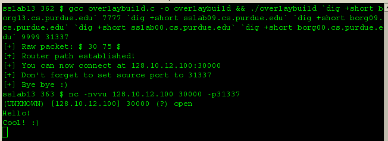
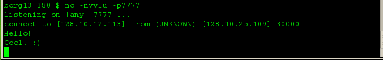
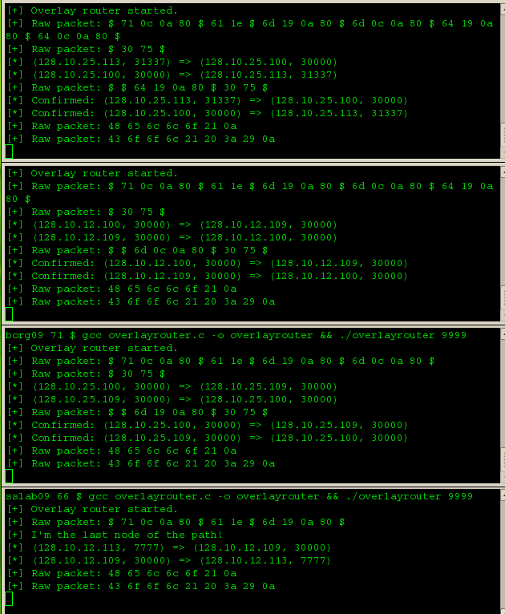

### Purdue CS536 - Data Communications and Computer Networking - Fall 2015
### Lab 6: Overlay Network Routing and Turbo Charged Data Transport
___

### Problem Description

In this problem, we will consider routing in overlay networks that allows users in the end-to-end Internet 
to influence the paths a flow may take. In general, users (i.e., end systems) cannot affect intra- and 
inter-domain routing which determine the path a packet takes. If, for example, a company is a customer 
of a stub autonomous system X (an access provider) and wishes to send data from an IP device A in X to 
an IP device B in AS Y, then inter-domain BGP routing determines the path a packet takes from X and Y 
which may include a transit AS Z. If Z's routers are located in an "unfriendly" region and the company 
is concerned about industrial espionage, in general, the company's only recourse is to encrypt its flow. 
Using overlay network routing, the company may be able to by-pass AS Z by employing one or more IP devices 
located in a transit AS V. A's traffic is sent to an IP device C located in V which then forwards the 
traffic to B located in Y. Assuming Z is not a transit AS en route from A to C to B, the company has 
succeeded in circumventing AS Z. To ensure that Z is not traversed, it may be necessary to recruit 
more than one forwarding IP device across multiple transit domains.

Another example of overlay network routing is anonymizing sources. A client that does not wish to reveal 
its location may employ multiple forwarding nodes to hide its identity. Although real-time tracking while 
a flow is on-going is feasible, multi-hop forwarding increases the effort expended to backtrack the source.
Overlay networks allow arbitrary logical network topologies to be embedded in physical network topologies, 
a form of virtualization that exports customer tailored views of a shared network which can be useful when 
structuring distributed computing services.

To achieve overlay network routing, we will build on the tunneling implementation of Problem 1, lab4. 
As in the tunneling server, the overlay network router daemon, overlayrouter, takes a command-line 
argument 
```
% overlayrouter server-port 
```

where server-port is a well-known port number on which it waits for client requests. 
A client request is transmitted by running overlaybuild 
```
% overlaybuild dst-IP dst-port routerk-IP ... router2-IP router1-IP 
```

where the command-line arguments specify the final destination's IP address dst-IP and port number 
dst-port, and the IP addresses of a sequence of k overlay network routers that a packet should traverse 
(starting at router1-IP) before being forwarded by the Internet routing system to reach dst-IP. 
overlaybuild, when executed at a source with IP address src-IP and port number src-port, sends a UDP 
packet to router router1-IP at port number server-port whose payload has the format 
```
$dst-IP$dst-port$routerk-IP$...$router2-IP$router1-IP$ 
```

As in the tunneling application, overlayrouter returns a UDP ACK to overlaybuild which contains a port 
number, data-port-1, to be used for actual data traffic from src-IP. overlaybuild prints data-port-1 to 
stdout so that it can be used by a UDP-based legacy app in its command-line argument. For example, in 
the case of the traffic generation app traffic_snd, we have 
```
% traffic_snd router1-ip data-port-1 payload-size packet-count packet-spacing 
```

As in the tunneling app, since we don't have root privilege to modify the kernel to enable full 
transparency, the first-hop overlay router IP address router1-ip is specified in place of dst-IP 
in the command-line argument of the legacy app.

overlayrouter running at router1-IP, after receiving the client request 
```
$dst-IP$dst-port$routerk-IP$...$router2-IP$router1-IP$ 
```

returns a UDP ACK with data-port-1 if the last IP address inscribed in the message matches its own 
IP-address. If there is a mismatch, the path set-up message is discarded. We will assume that a 
multi-homed device uses a designated IP address for overlay network routing purposes. After a match, 
router1-IP proceeds by contacting the next-hop overlay network rourter router2-IP at port number 
server-port to set up the remaining overlay path. Before doing so, it strips its own IP address
from the received message and forwards 
```
$dst-IP$dst-port$routerk-IP$...$router2-IP$ 
```

to router2-IP at server-port from router1-IP with port number data-port-1. overlayrouter running at 
router2-IP returns a UDP ACK containing an unused port number data-port-2 to router1-IP at port number 
data-port-1. overlayrouter running at router1-IP maintains a routing table which specifies that UDP 
packets arriving from (src-IP, src-port) should be forwarded to (router2-IP, data-port-2). The table 
also specifies that a UDP packet arriving from (router2-IP, data-port-2) should be forwarded to 
(src-IP, src-port). Thus the sender IP address/port number pair is used as a label to determine where 
to forward a packet (called label switching). At overlay router router2-IP, the routing table entry 
will contain (router1-IP, data-port-1) as source label and (router3-IP, data-port-3) as destination 
label, and vice versa for packets in the reverse direction. The update process is repeated at every 
intermediate overlay network router until the last hop is reached. routerk-IP knows that it is the 
last hop by checking that after stripping its IP address the message is 9 bytes ( = |$dst-IP$dst-port$|) 
long. After updating its route table, further forwarding of the overlay path set-up message is ceased.
Make all overlay routers print route table updates to stdout for verification. The last hop routerk-IP 
confirms that the requested overlay network path has been successfully set up by sending a UDP packet 
to the previous hop at port server-port with payload 
```
$$routerk-IP$data-port-k$ 
```

which signifies to the previous hop router(k-1)-IP that the routing table entry is confirmed. 
router(k-1)-IP, after performing route table look-up, sends a confirmation packet containing 
```
$$router(k-1)-IP$data-port-(k-1)$ 
```

to router(k-2)-IP with port number server-port. Eventually a confirmation will arrive at router1-IP at 
which point the overlay path will have been established. During the set-up phase, consider a routing 
table entry temporary until confirmation is received. This can be done by adding a flag in the routing 
table or using a separate data structure (e.g., delta list) for temporary entries until they are 
confirmed. A temporary routing table entry will become invalid if 30 seconds elapse after it has been 
created. As noted above, print to stdout routing table updates for verification, and include the IP 
address of the router doing the printing and its current time stamp. In production code, we would deal 
with additional issues such as UDP management packets getting lost, sending a notification to src-IP 
when a path is confirmed, and sending management packets to tear down an overlay path when not needed. 
For present purposes, these auxiliary tasks will be ignored.

During testing, run overlayrouter on several sslab and borg machines across both labs. Using a single 
client running on a separate client machine, test that overlay path set-up initiated by overlaybuild 
works correctly. Use the UDP traffic generation and ping apps from lab4 and lab2 as legacy benchmark 
apps. As noted in class, since the legacy app needs to use the same port as overlaybuild for correct 
forwarding at the first hop router, modify the legacy app so that it uses a specified port number 
instead of an ephemeral port number. After single client tests, use multiple clients so that each 
overlay network router manages multiple overlay paths using a single routing table at each overlay 
router. In the ping app, compare the ping results when a ping server is contacted through an overlay 
path with when it is directly reached. In the case of the traffic generation app, for packet spacing 
1 msec and payload size 1000 bytes, compare the measured throughput achieved at the receiver. Discuss 
your findings in lab6ans.pdf and place the file in lab6/.


#### Additional Notes

* Assume the overlay build command line argument as - 
``` 
	% overlaybuild dst-IP dst-port routerk-IP ... router2-IP router1-IP overlay-port build-port. 
```

This 'overlay-port' is the known port number on the intermediate routers for listening to new connections.
The 'build-port' is the port number on which the overlay-build runs. The client myping and 
traffic_snd should use the same port as the port that overlaybuild was running on.

* The format for the acks from the overlay routers should only be the dedicated port number once it 
registers the connection.

* The format of the message should be 
```
	$dst-IP$dst-port$routerk-IP$...$router2-IP$router1-IP$
```

Code is written in C++. We have 2 classes: **usriface** which provides a strict API for
GUI, and **asyncomm** which provides an API for asynchronous communication.

___
### Solution

For our experiments we’ll use the **sslab13.cs.purdue.edu** as the source node and the 
**borg13.cs.purdue.edu** as the destination node. We’ll also use the following nodes as overlay routers: 
```
	Router #1: borg00.cs.purdue.edu 
	Router #2: sslab00.cs.purdue.edu 
	Router #3: borg09.cs.purdue.edu 
	Router #4: sslab09.cs.purdue.edu 
	Router #5: xinu09.cs.purdue.edu
```

We tested overlay network with more than one concurrent source/destination pairs and worked without 
any problems. In the figures below you can see a small example of an overlay network using 4 routers. 
The netcat client can successfully connected to the final server and bidirectional communication can 
be achieved without any problems.




Note here that the netcat server sees connection coming from 128.10.25.109 (sslab09.cs.purdue.edu), but the client is located 
at sslab13.cs.purdue.edu.



___
