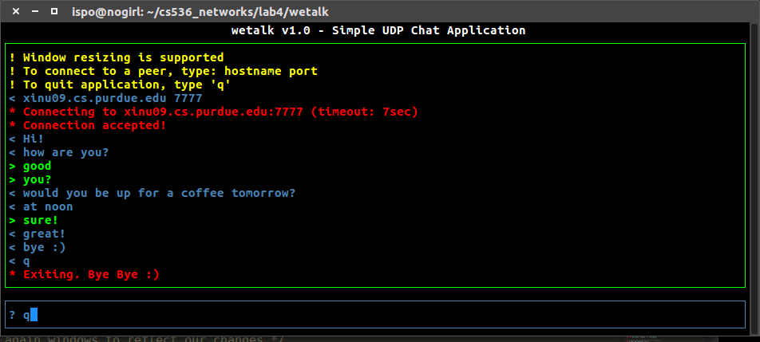
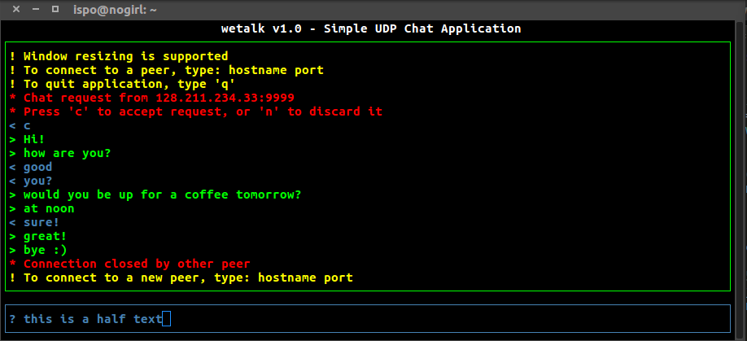
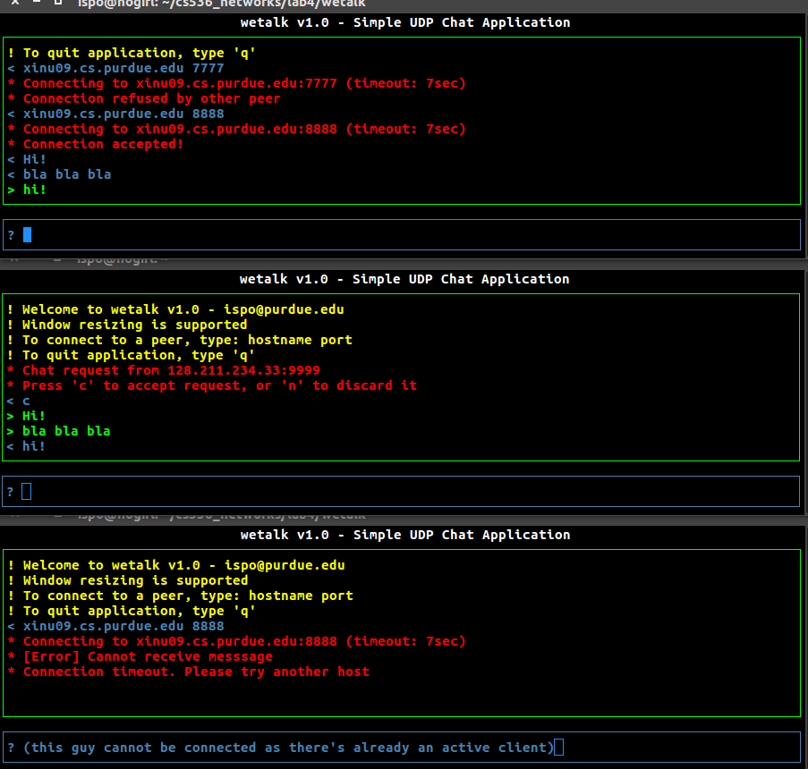

### Purdue CS536 - Data Communications and Computer Networking - Fall 2015
### Lab 4: Symmetric Client/Server Application
___

### Problem Description

Not long after the Stone Age but before the full advent of the X Window System and GUI-based applications, 
a popular app for performing texting/chatting/instant messaging was talk. talk was a symmetric 
client/server app, also referred to as a peer-to-peer (P2P) app in later jargon, where there is 
no inherent differentiation between server and client. That is, the talk app is both server and 
client. This is different from the asymmetric client/server apps we have encountered in the labs 
so far whose design dominate today's Internet app landscape. 

You will develop a UDP-based talk app, call it wetalk, where wetalk is invoked with a single 
command-line argument 
```
% wetalk my-port-number 
```

which specifies the port number that wetalk will use to communicate using UDP. When wetalk runs, 
it will bind itself to my-port-number and print a prompt "? " to stdout and wait for stdin input 
from the user. A user commences a chat by typing the hostname and port number of the peer that 
he/she wishes to converse with. wetalk sends a UDP packet to initiate a chat session by inscribing 
the string "wannatalk" in the datagram's (UDP packets have historically been referred to as datagrams)
payload. If the peer does not respond within 7 seconds (use SIGALRM handler to affect timeout) wetalk 
outputs to stdout a suitable message that indicates no response, prints the "? " prompt and waits 
for user input. The user may initiate another connection or quit the app by typing 'q' (followed 
by RETURN/ENTER). The peer may not respond because wetalk is not running at the specified IP 
address/port number, or the UDP control message "wannatalk" was lost. 

If wetalk is running at the peer, it will print to stdout the message "| chat request from peer-IP 
peer-port" on a new line where peer-IP and peer-port are the IP address and port number of the 
initiating peer. wetalk prints the "? " prompt on a new line and waits for user input. If the 
user types 'c' then a chat connection is completed by sending a UDP datagram with payload "OK" 
to the requesting party. If the user enters 'n' then the payload "KO" is sent indicating that 
the peer does not wish to chat. wetalk at the initiating party prints "| doesn't want to chat", 
prints "? " on a new line and waits. 

Once a chat session has been established, wetalk prints the prompt "> " on a newline and juggles 
two tasks. First, it must read the characters (i.e., message) typed by its user and when RETURN/ENTER 
is input send a UDP packet with the message as its payload. A single message is not allowed to exceed 
50 bytes. If it does, the message is truncated. The message in the UDP payload is preceded by the ASCII 
character 'D' indicating that what follows is a message. If the user enters the single character 'e' 
(followed by RETURN/ENTER) then this will mean that the user is done chatting and wetalk transmits a 
UDP packet with the single character 'E' as payload indicating session termination. wetalk at the other 
end prints "| chat terminated" and returns to the "? " prompt. 

Second, while a user is in the midst of typing a chat message, a chat message from the peer may 
arrive that needs to be displayed. The Linux kernel will raise the SIGPOLL (equivalently SIGIO) 
signal when a UDP packet arrives. The code structure of wetalk should be such that after a chat 
session has been established, its main body makes a blocking call to read() or getchar() to read 
user input from stdin one byte at a time until newline. When newline is entered, wetalk transmits 
the message in a UDP datagram as specified above. Printing of incoming chat messages from the peer 
are handled asynchronously by registering with the Linux kernel a SIGPOLL handler that handles the 
task of printing the received chat message to stdout. Note that there are subtleties that must be 
carefully handled such as two chat messages arriving from the peer back-to-back. Since the Linux 
signal handling system does not keep track of how many UDP packets have been received, before your 
SIGPOLL handler returns it needs to check that there are no further chat messages waiting in the 
kernel buffer. Any messages from the peer should be printed on a new line and preceded by "| " to 
indicate an incoming message. 

To focus on the networking component of the app design, we will not utilize graphical user interfaces 
or use curses to manage terminal output. talk used the curses package which allowed the a character 
terminal to be split into two halves so that a user could type messages in one half and see the peer's 
chat messages in the other. Curses terminal I/O programming is bug prone and challenging. GUI programming 
is much simpler but not required for our purposes. We will implement simple hacks to not overly confuse 
the wetalk user and make chat sessions legible. In particular, if a user is in the midst of typing 
"Let's go to dinn" and the message "How about dinner?" arrives, we don't want the SIGPOLL handler 
to just dump the received chat message to stdout which the user would see as "Let's go to dinnHow 
about dinner?". Instead, to make the chat session more readble, the SIGPOLL handler will print on 
a new line the received message "| How about dinner?". It will also print the partly typed message 
"Let's go to dinn" on a new line so that the user can continue typing the message where he/she left off. 

To do so, the incomplete terminal input "Let's go to dinn" must be read and remembered before the 
user completes the message and types RETURN/ENTER. The simplest method is to put the terminal into 
raw (i.e., unbuffered) mode from its default canonical (or cooked) mode where characters are buffered 
until newline is entered (i.e., line discipline). Use Linux support for termios with tcgetattr() and 
tcsetattr() system calls to switch modes. Note that since you are juggling multiple signals (SIGALRM, 
SIGPOLL), the socket descriptor must be set in asynchronous mode. UDP packets may be lost and wetalk 
does not provide reliable transport. We defer this functionality to the human user. That is, should 
a message get lost, the human would just mimick ARQ by sending "Are you there?" and retyping the lost 
message. Reliable communication, which incurs significant overhead, need not always be the 
responsibility of network protocols for an app to be usable. Implement and test your wetalk app 
on a pair of lab machines and submit the code in lab4/.

Bonus. As an extension, GUI or the curses library makes wetalk much easier to use. Use either 
(curses should be attempted by those only already familiar with low-level terminal I/O 
programming) to enhance the user interface of wetalk. For example, in Linux, GTK+ may be 
used build simple interfaces. X Windows with varying widget support is a more low-level approach.


___

### Solution design

If we view a peer as a state diagram, our design can stay simple:

```
                                                 ("q",-)
 +-------+         +------------------------------------------------------------------+
 | START |-----+   |                                                                  |
 +-------+     |   |                  timeout/(-,"KO")                                |
               |   |   +------------------------------------------------+             |
               |   |   |                                                |             |
               v   |   v                                                |             |
          +----+---+---+----+      ("hostname port", +)        +--------+--------+    |
 +------->|      IDLE       |--------------------------------->|      WAIT       |    |
 |        +--------+--------+                                  +--------+--------+    |
 |                 |                                                    |             |
 |                 |(-,"wannatalk")                                     |(-,"OK")     |
 |                 |                                                    |             |
 |("n",-)          |                                                    |    (*,*)    |
 |                 |                                                    |  +--------+ |
 |                 v                                                    v  v        | |
 |        +--------+--------+             ("c",-)              +--------+--+-----+  | |
 |        |     REQUEST     |--------------------------------->|      ASSOC      |  | |
 |        +--------+--------+                                  +--------+--+-----+  | |
 |                 |                                                    |  |        | |
 |                 |                                      ("q",-)(-,"E")|  +--------+ |
 +-----------------+                                                    |             |
                                                                        v             |
                                                                    +---+---+         |
                                                                    | CLOSE |<--------+
                                                                    +-------+
```

Code is written in C++. We have 2 classes: **usriface** which provides a strict API for
GUI, and **asyncomm** which provides an API for asynchronous communication.

### TODOs:
* A client can be connected to itself. Fix it.


### Screendumps




___
Our implementation does not allow a 3rd peer to be associated with a peer that is already
connected to a 2nd peer (which is something desired). This solution can be tricky, as the
protocol that is used is UDP, so there's no notion of connection. However we use the 
connect() old school trick to handle such cases.



___

